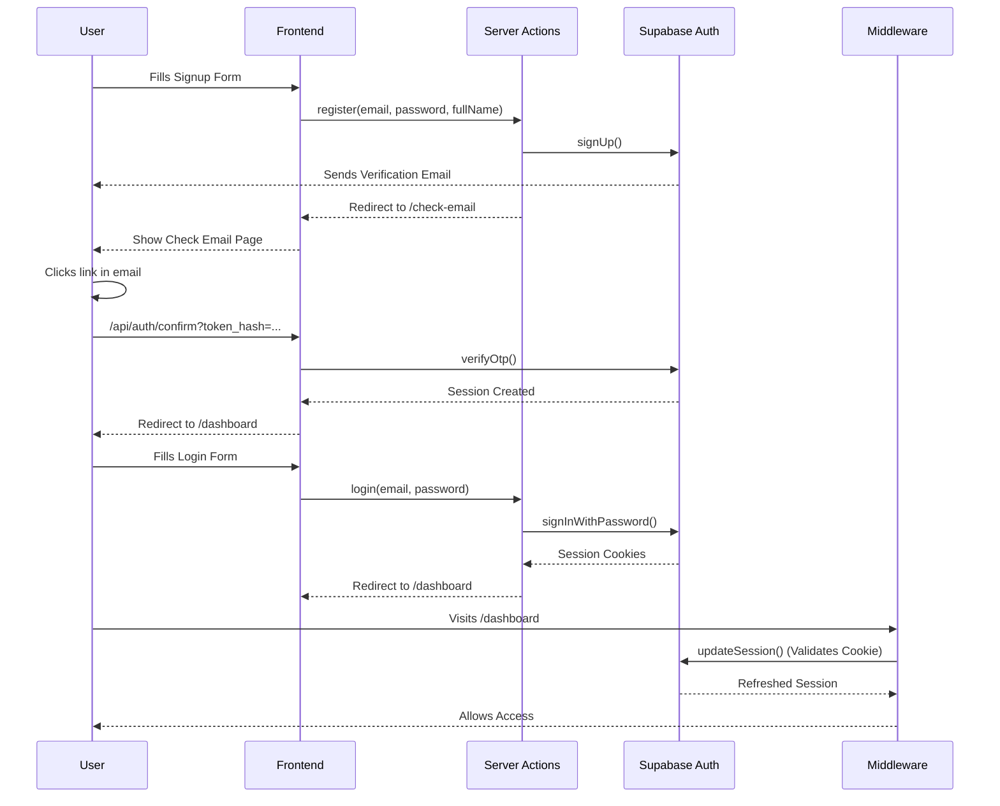

# MySafeVault Authentication Flow

```mermaid
sequenceDiagram
    participant User
    participant Frontend
    participant Server Actions
    participant Supabase Auth
    participant Middleware

    %% Signup Flow
    User->>Frontend: Fills Signup Form
    Frontend->>Server Actions: register(email, password, fullName)
    Server Actions->>Supabase Auth: signUp()
    Supabase Auth-->>User: Sends Verification Email
    Server Actions-->>Frontend: Redirect to /check-email
    Frontend-->>User: Show Check Email Page

    %% Email Verification
    User->>User: Clicks link in email
    User->>Frontend: /api/auth/confirm?token_hash=...
    Frontend->>Supabase Auth: verifyOtp()
    Supabase Auth-->>Frontend: Session Created
    Frontend-->>User: Redirect to /dashboard

    %% Login Flow
    User->>Frontend: Fills Login Form
    Frontend->>Server Actions: login(email, password)
    Server Actions->>Supabase Auth: signInWithPassword()
    Supabase Auth-->>Server Actions: Session Cookies
    Server Actions-->>Frontend: Redirect to /dashboard

    %% Middleware Protection
    User->>Middleware: Visits /dashboard
    Middleware->>Supabase Auth: updateSession() (Validates Cookie)
    Supabase Auth-->>Middleware: Refreshed Session
    Middleware-->>User: Allows Access
```
